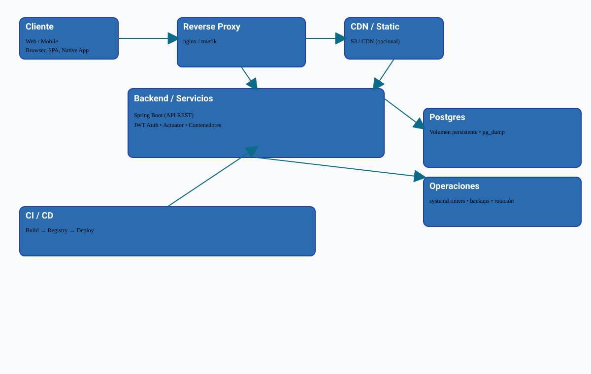
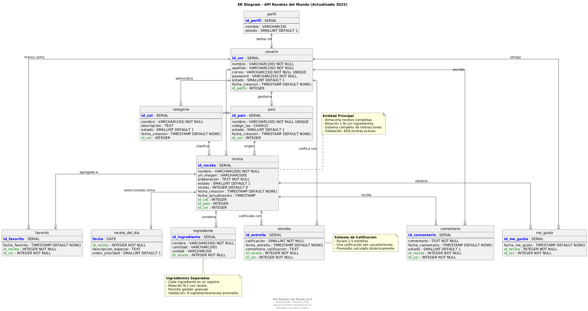
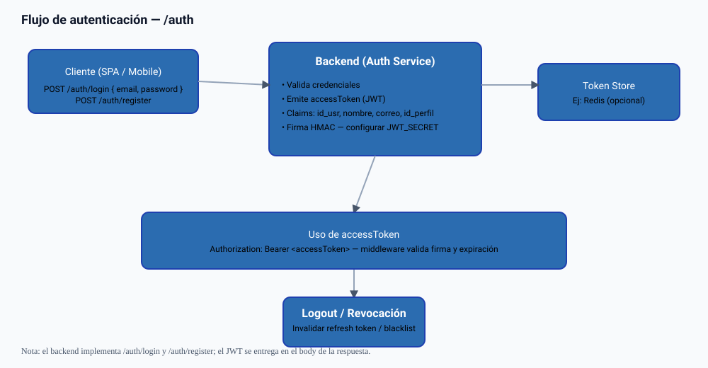
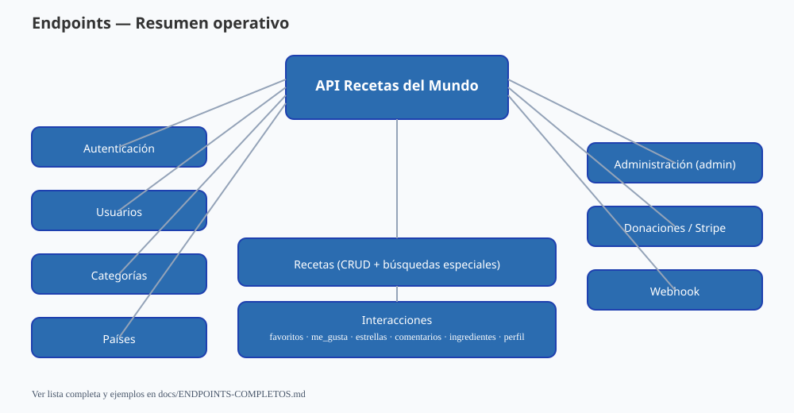

# 🍽️ API Recetas del Mundo — Resumen ejecutivo y guía técnica

Versión profesional del README, alineada con la presentación técnica en `docs/presentation_architecture.html`. Este documento está pensado para CTOs, equipos DevOps e inversores: resume la propuesta de valor, arquitectura, operaciones críticas y cómo arrancar el sistema.

## Resumen ejecutivo

API Recetas del Mundo es una API RESTful contenerizada, diseñada para producción con Docker y portable a Kubernetes. Ofrece:

- Backend modular en Spring Boot con autenticación JWT y hashing con BCrypt.
- Modelo relacional en PostgreSQL 15 optimizado para búsquedas por país y categoría.
- Funcionalidad social y de monetización: favoritos, comentarios, rating y donaciones.
- Estrategia operativa: imágenes reproducibles, Pipelines (integración y despliegue continuos), backups automáticos y pruebas de restore.

Estado actual: API operativa y validada (ver `docs/ENDPOINTS-COMPLETOS.md` para la lista completa — ~42 endpoints confirmados).

---

## Visión rápida

Este repositorio contiene el backend de "Recetas del Mundo": una API REST construida con Spring Boot y PostgreSQL que gestiona recetas, ingredientes, interacciones (favoritos, me gusta, estrellas, comentarios), usuarios, categorías y donaciones (Stripe).

---

## Contenido

- `Springboot/` — código del backend (Java, Maven).
- `docs/` — documentación técnica: OpenAPI (`openapi.json`), diagramas ER, SVGs de arquitectura y flujos, listas de tablas/columnas/constraints y guía de endpoints completa.
- `scripts/` — scripts para backup, E2E automatizados en PowerShell y utilidades.
- `database/` — utilitarios y conexión a la base de datos.

---

## Resumen rápido

- API lista para ejecución local en `http://localhost:8081`.
- Endpoints principales: `/auth`, `/usuarios`, `/categorias`, `/paises`, `/recetas` (incluye CRUD y muchas rutas de interacción).
- Documentación OpenAPI generada: `docs/openapi.json` y Swagger UI (si se levanta la app).

---

## Requisitos

- Java 21+ (el backend de esta rama se compiló y ejecuta con JDK 21)
- Maven 3.6+
- Docker
- Docker Compose (o `docker compose` integrado)
- PostgreSQL (solo si ejecutas la DB fuera de Docker)
- Spring Boot (solo para desarrollo local)

---

## Cómo ejecutar

### Compilar y ejecutar el JAR

1. Compila el proyecto:

```powershell
cd Springboot
mvn -DskipTests package
```

2. Ejecuta el JAR:

```powershell
java -jar target/api-recetas-0.0.1-SNAPSHOT.jar --server.port=8081
```

### Usar Docker Compose (si está configurado en la raíz)

```powershell
docker compose build backend
docker compose up -d backend
```

### Uso de docker-compose: `docker-compose.yml` vs `docker-compose.prod.yml`

Este repositorio mantiene dos archivos `docker-compose` con roles distintos:

- `docker-compose.yml` — Archivo principal pensado para desarrollo local. Contiene la sección `build:` para construir la imagen del backend desde `./Springboot`, monta el directorio `./database` para inicializadores y contiene valores por defecto para conveniencia (no recomendado para producción).
- `docker-compose.prod.yml` — Variante orientada a producción. Usa imágenes (campo `image`) en vez de `build`, declara volúmenes como `external` (espera que los volúmenes ya existan en el host) y no incluye valores por defecto sensibles — exige que proveas las variables de entorno.

Ejemplos de uso:

```powershell
# Desarrollo (con build local)
docker compose build backend
docker compose up -d

# Producción (usar archivo prod y un .env con variables seguras)
docker compose -f docker-compose.prod.yml --env-file .env up -d
```

Recomendaciones:

- No mantengas secretos en los archivos `docker-compose` ni en el repo. Usa `.env` (no versionado) o un gestor de secretos para valores sensibles (DB password, JWT secret, claves Stripe).
- `docker-compose.yml` es cómodo para desarrollo; `docker-compose.prod.yml` refleja el comportamiento esperado en despliegues (imágenes ya construidas, volúmenes administrados por la plataforma).
- Para entornos Windows use Git Bash o WSL cuando ejecute los scripts de backup/restore que dependen de utilidades POSIX (tar, mktemp). Hay un script PowerShell `scripts/restore_volumes_from_backup.ps1` para restauración de volúmenes desde Windows, pero la vía más robusta es ejecutar `scripts/restore_recetas_stack.sh` desde WSL/Git-Bash.

### Variables de entorno importantes

- `JWT_SECRET` — secreto para firmar JWT.
- `JWT_EXPIRATION_MS` — tiempo de expiración del token (ms).
- `DATABASE_URL` / `SPRING_DATASOURCE_*` — conexión a Postgres.
- `STRIPE_SECRET_KEY` — (opcional) para activar pagos/checkout real.

> Nota: No dejes claves en el repo. Usa variables de entorno o un archivo `.env` excluido en `.gitignore`.

---

## Documentación de API

- Swagger/OpenAPI: `docs/openapi.json` (la app expone `/swagger-ui/index.html` cuando está en marcha).
- Guía de endpoints completa (resumen y ejemplos): `docs/ENDPOINTS-COMPLETOS.md`.

### Endpoints destacados

- Autenticación: `POST /auth/login`, `POST /auth/register`.
- Recetas: `GET /recetas`, `GET /recetas/{id}`, `POST /recetas` (crear con ingredientes), `PUT /recetas/{id}`, `DELETE /recetas/{id}`.
- Interacciones centralizadas bajo `/recetas/*`: favoritos, me_gusta, estrellas, comentarios e ingredientes (agregar/actualizar/eliminar).
- Otros: `/categorias`, `/paises`, `/usuarios`.

Consulta `docs/ENDPOINTS-COMPLETOS.md` para la lista y ejemplos de uso.

---

## Diagrama de arquitectura


Arquitectura:

La imagen muestra los componentes principales: cliente, reverse proxy, backend y la base de datos. Indica cómo fluye el tráfico desde el cliente hacia el backend y cómo se manejan backups y operaciones. Es útil para diseñar despliegues y planificar disponibilidad y seguridad. Las flechas muestran dependencias importantes y puntos de integración.

## Diagrama ER  


Diagrama ER (Entidad-Relación):

Resumen de las tablas principales y sus relaciones FK (usuario, receta, ingrediente, comentario, donación, etc.). Útil para entender integridad referencial, claves primarias y las columnas esenciales como `fecha_creacion`. Sirve como referencia para migraciones y consultas optimizadas.

## Diagrama de Autenticación


Flujo de autenticación:

Describe el proceso de login/registro: el cliente envía credenciales, el backend valida y emite un JWT, y las peticiones subsiguientes usan Authorization Bearer. Incluye logout/revocación y el uso del token en middleware. Ideal para implementar y auditar seguridad en endpoints.

## Diagrama de Enpoints


Overview de endpoints:

Mapa de los módulos expuestos por la API (auth, usuarios, categorias, recetas, administración y donaciones). Proporciona una vista rápida para desarrolladores que quieren saber dónde implementar cambios o cómo integrar frontend y pruebas E2E.

---

## Backups y restauración

- Hay scripts para backup en `scripts/` (PowerShell y bash). Los scripts principales son:

	- `scripts/backup_recetas_stack.sh` — crea un backup completo que incluye: imágenes Docker, dump SQL, configuración y (cuando se detectan) volúmenes. Resultado: `backups/complete_backup_YYYYMMDD_HHMMSS.tar.gz`.
	- `scripts/restore_recetas_stack.sh` — restaura imágenes, volúmenes y (opcionalmente) importa el dump SQL. Diseñado para ejecutarse en Linux/WSL/Git-Bash; acepta variables de entorno como `DEPLOY_DIR` y `COMPOSE_UP`.

- El dump SQL principal suele estar en `database/init.sql` (asegúrate que esté en UTF-8 sin BOM). Si tu dump tiene problemas de encoding conviértelo a UTF-8 antes de usarlo.

## Pruebas E2E

- Scripts E2E en PowerShell: `scripts/e2e_*.ps1`. Están preparados para ejecutarse contra `http://localhost:8081`.
- Variables útiles: `E2E_BASE_URL`, `E2E_EMAIL`, `E2E_PASSWORD`.

---

## Contacto

Equipo de desarrollo — `dev@recetas.cl` (consulta `docs/openapi.json` para más metadatos de contacto).

---

## Conclusión

API Recetas del Mundo ofrece una base técnica sólida para productos culinarios digitales que requieren estabilidad, seguridad y capacidad de crecer a escala. Está pensada para equipos que necesitan una solución híbrida —capaz de coexistir con sistemas legacy y migrar hacia la nube— reduciendo riesgos operacionales y acelerando la entrega de valor.

Puntos clave:

- Despliegue reproducible (imágenes, Pipelines — integración y despliegue continuos).
- Escalabilidad horizontal mediante servicios stateless y réplicas.
- Operaciones seguras: gestión de secretos, backups automatizados y rotación.

© 2025 API Recetas del Mundo. Todos los derechos reservados.

